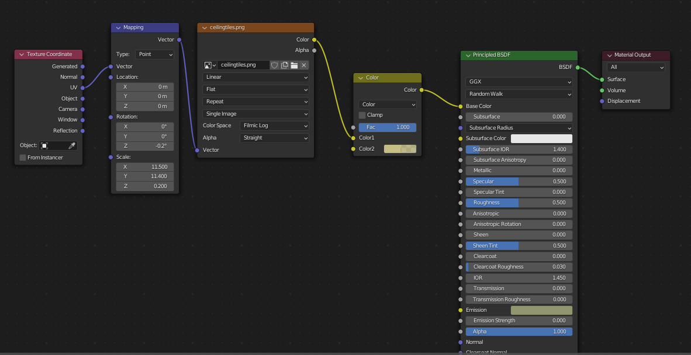
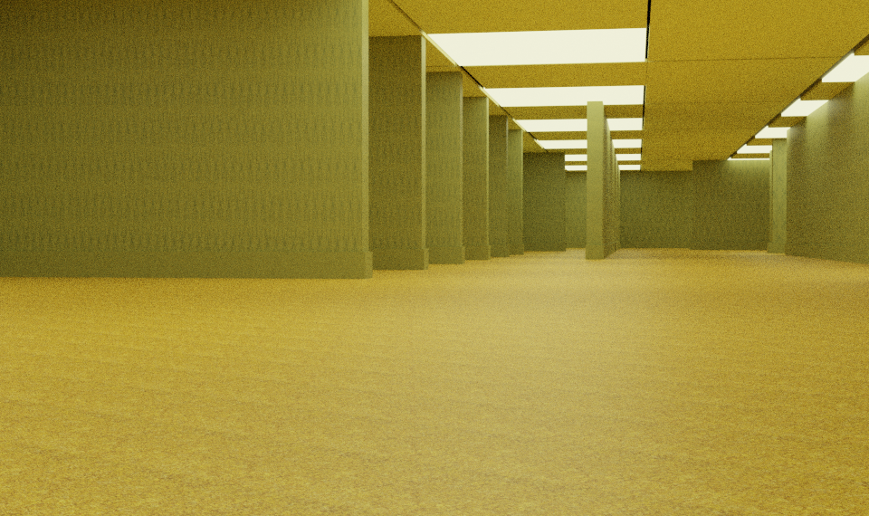
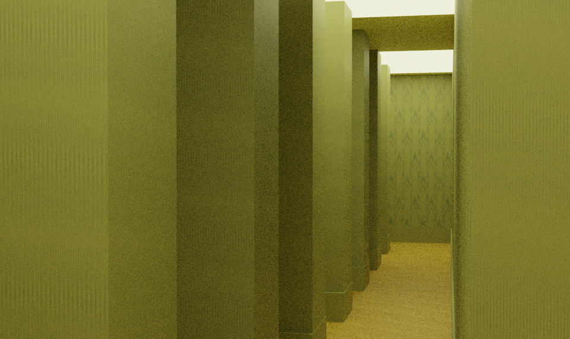
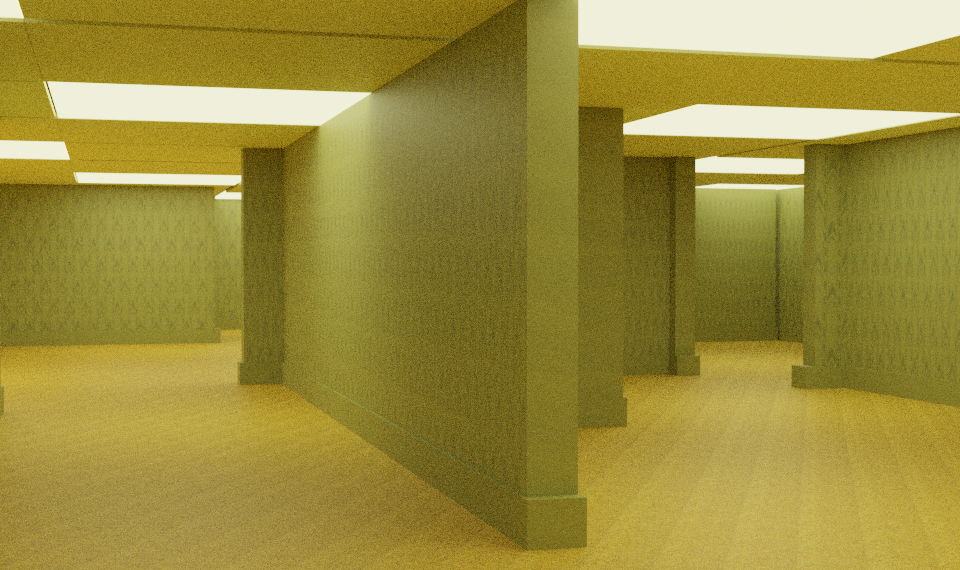

## Summary:

For this project, I completed the following [tutorial](https://www.youtube.com/watch?v=qgWMjCgPywo)

## Notes:

- To duplicate objects in an Array, use the array modifier.
- To generate a matrrix of objects, apply two Array modifiers in succession.

## Making Ceiling Tiles:
- this was the hardest part of the project.
- Tiles themselves were constructed with a plane square, and loop cuts on all four sides.
- Delete the middle of the loop cut by switching to face select mode + xray mode, and selecting the middle, then delete- Once this is done, you can extrude and duplicate your box frame, and make a grid pattern.
- Lights are just flattened cubes scaled to fit into the frames, as are ceiling tiles.
- Ceiling Tiles have an applied texture, lights use emission texture properties to give off light.
- When a ceiling tile section is finalized, select all parts and RC -> Join to make a grouped object.

## Node Settings for Project:

## Some Sample Renders:

