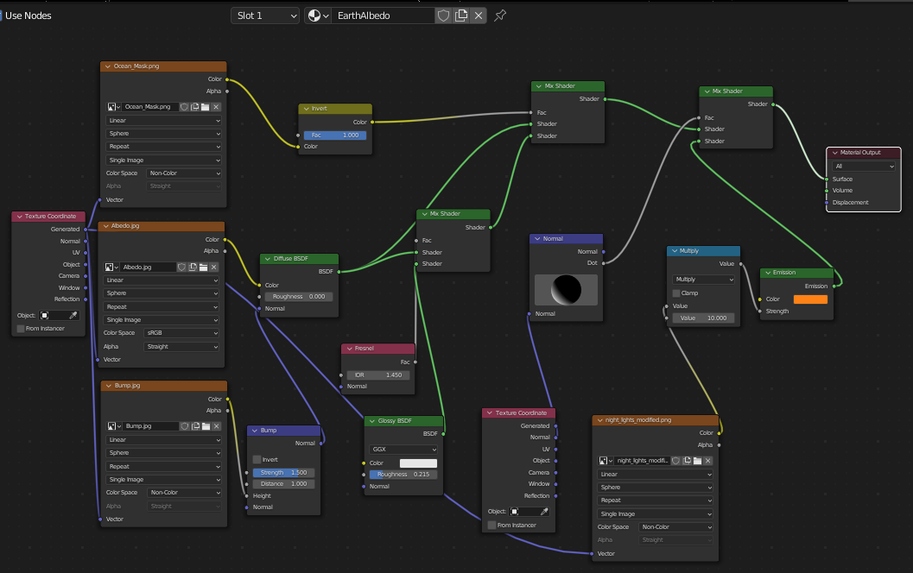
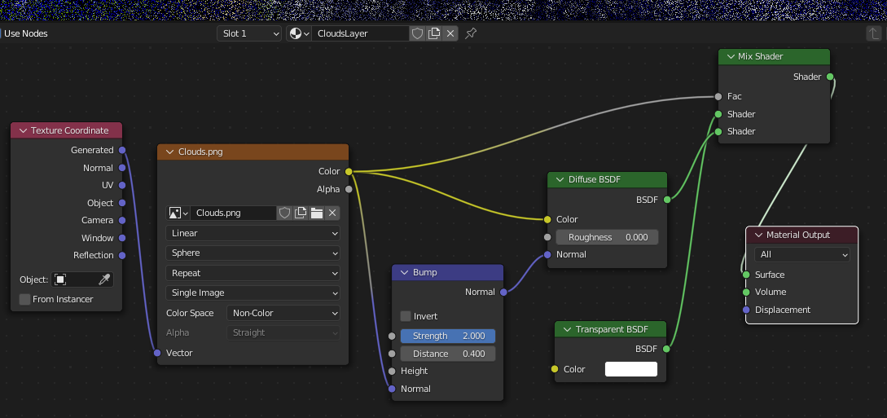
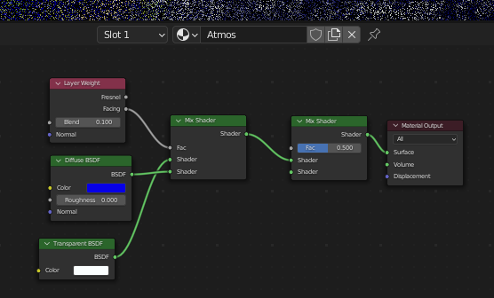
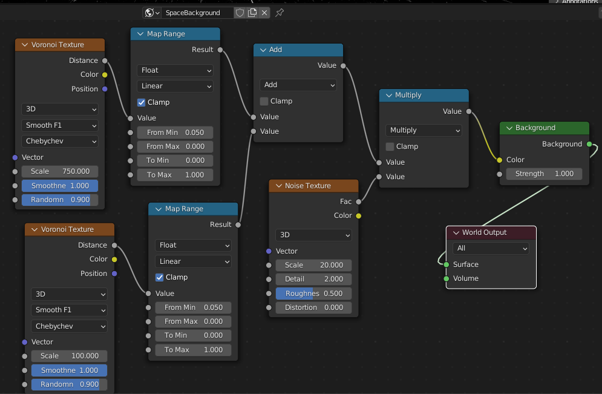

 
## Materials and Shaders (Notes):

### Earth's Surface:

By far the most complicated material layer. Let's break this down into parts:

1) For the surface of the Earth, NASA provides 3 images. An Albedo Image (which looks like a Map of the Earth), a Bump Map, and an Ocean Mask. The first two should be obvious, however the latter is used to avoid reflectivity on the land. For a realistic Earth Render, we should only have the ocean reflecting light back into space (noticably). All textures are mapped spherically, to avoid deformations.

To add further realism, we add city lights at night for the dark half of the planet.

The most difficult part of this setup was the Normal Sphere. This adjusts our city lights so they sit only on the dark side of the earth. It is hard to position this correctly using the user mouse! There is no caculable/parameterized way to adjust it sequentially, so expect some frustration using this.

### Clouds:

An image of clouds is mapped to a thin spherical shell above the main earth object.

First we have a Textured Coordinate node, that pulls coordinates from the surface of the layer. This is fed into our Clouds Image, to position the clouds spherically over the shell. We also use Bump Mapping (slightly) to give the clouds some height. Diffisuion and Transparent Shaders are mixed together, and drawn onto the shell as a final output.

### Atmosphere:

Our atmosphere consists of a blue coloured layer, mixed with a white transparent layer. The novel setting here is the "Facing" output used for the Layer Weight node. This causes our atmosphere to be transparent (when looking head on), but very reflective when looking at and angle. 

This creates the "blue atmosphere" effect we see on the sides of the Earth.

### Starfield Background:

This is not a material object layer, but a "World" layer. This is a scene background layer that can be manipulated with nodes, just like an Object's Material Shading.

The Blender Guru tutorial tried to shill a $50 plugin, so I used a free tutorial instead. The method of generation uses a heavily modified Voronoi texture, with skewed parameters to make it look like a starfield. 

Two sets of stars are drawn (one generated by each Voronoi texture). Far away stars, and close stars (within the Earth's local cluster) are generated. Some of the close stars are non-ciruclar, and appear like far away galaxies. It was a crude (but charming) effect, so I kept it.

