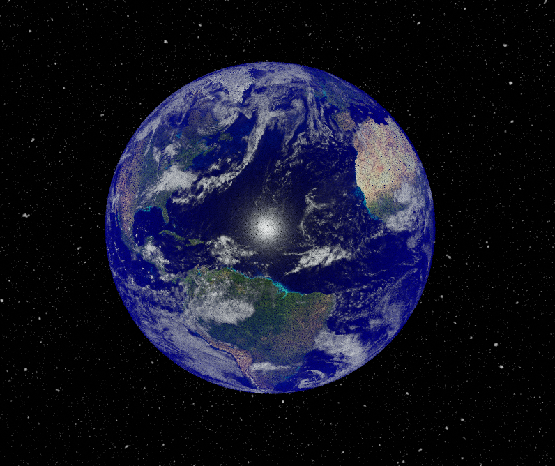
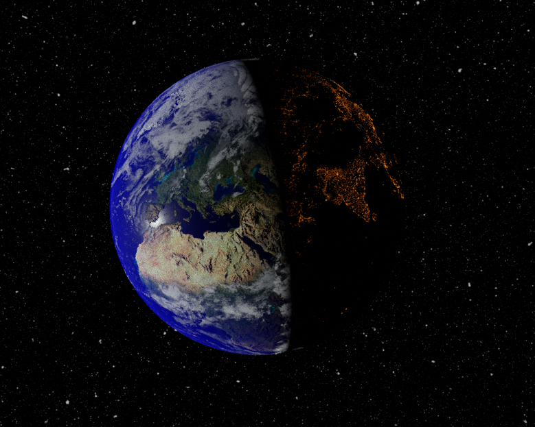
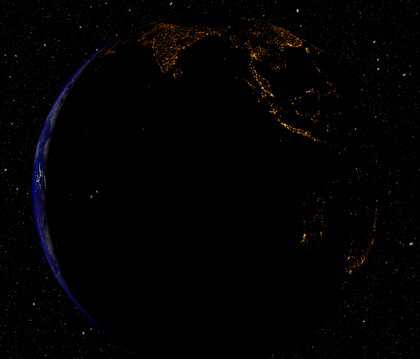
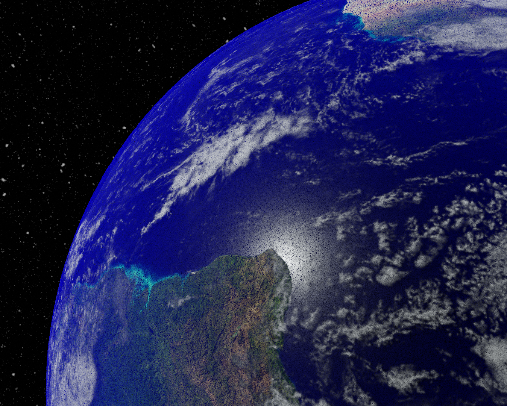

## Planet Earth Blender Project:

This project follows the BlenderGuru [Planet Earth Tutorial](https://www.youtube.com/watch?v=9Q8PwcDzb8Y) and uses an additional [Tutorial](https://www.youtube.com/watch?v=NJPFHRrTKXo) to generate a star-field background.

### Notes:

The basic idea behind this tutorial, is to take a sphere mesh and apply NASA satellite imagery as materials to the surface of the globe. 

Layers above the planet surface (such as atmosphere and clouds) are very thin spherical shells, in which clouds and a translucent blue atmospheric layer is placed.

For our light source, we use a point light source with high emission values, that lines up with the equator of the planet. 

To represent the tilt of the planet (23.4 degrees), the planet was simply rotated about the y-axis, and tilted away from the sun. As there exists a position on Earth's orbit where we would see the North Pole tilt away from the sun (during the summer months), this is realistic.

See the readme.MD in the **node_diagrams** folder, for more details about how the materials and shading was set up.

### Learning Points:

Learned a bit more about the Camera on this project. 
- NumPad 0: to see the current camera viewport
- CTRL+ALT+NP0: Change the camera viewport to the user's curent viewport.
- Main Parameters to adjust camera:
    - Focal Length
    - Sensor Size
    - Viewport Display -> Size

- Best way to get angled renders: Use the View Port rotation sphere (XYZ Axis in top right corner), and adjust user view to what you want to render. Then move Camera to this view using shortcuts listed above. Adjust settings to get the right distance and field of view.

### Rendered Images:

See below for samples:

