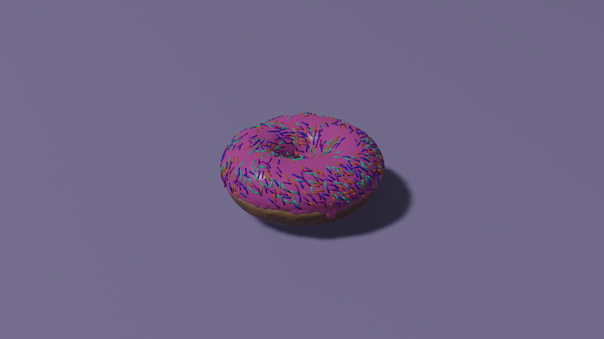
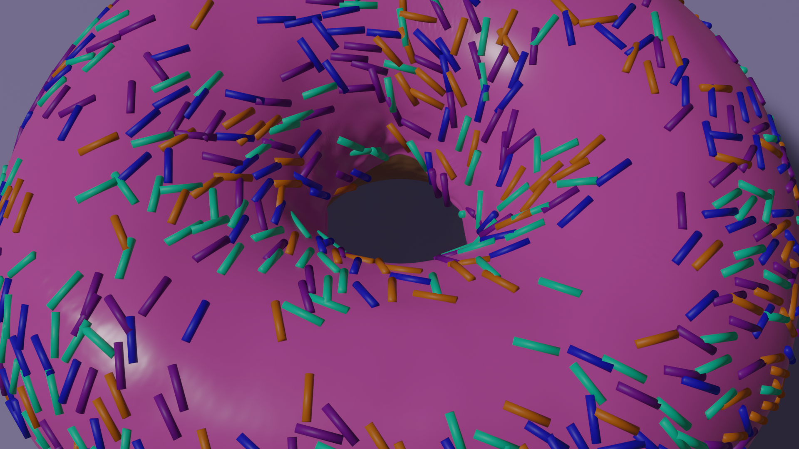
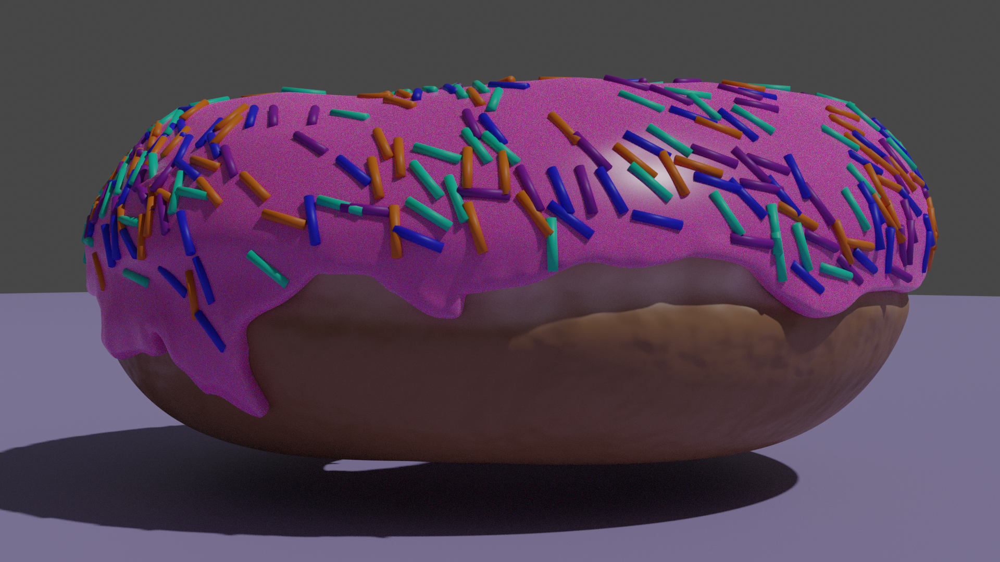
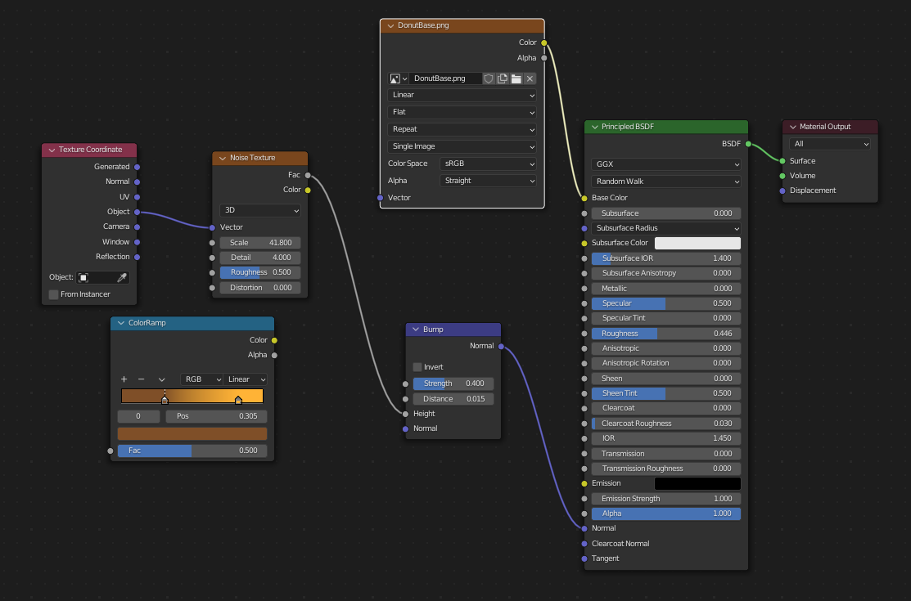
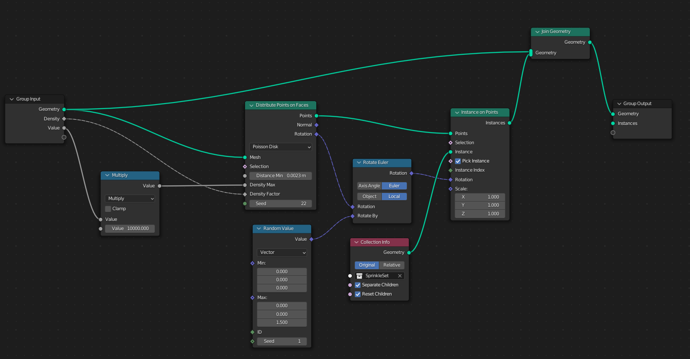

### 3D Donut: Blender Tutorial

The modelling portion of the [BlenderGuru Donut Tutorial]() can be seen below:

### Settings:

The following texture and geometry node settings were used to achieve these effects.

The animation portion will be done at a later date. 
